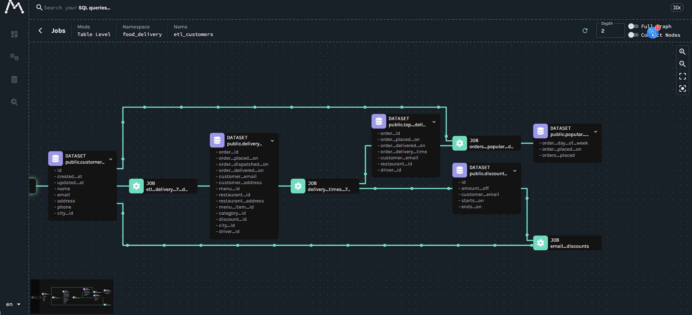
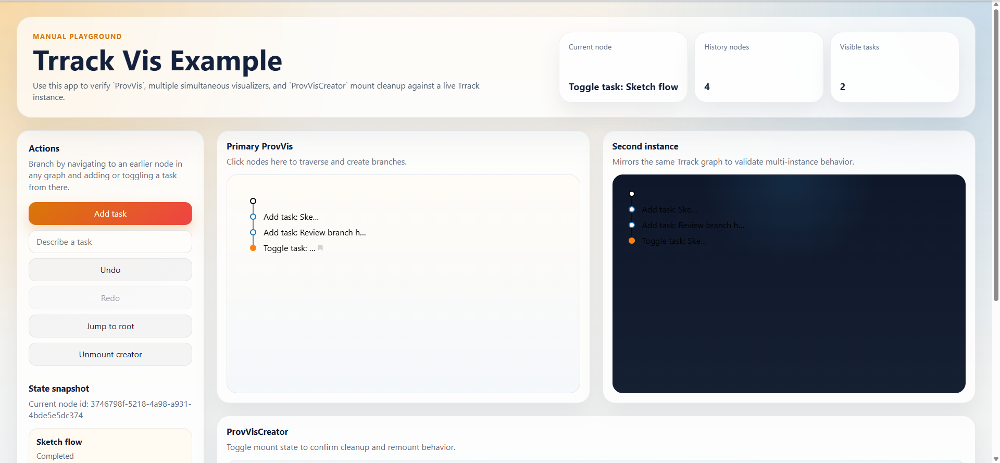
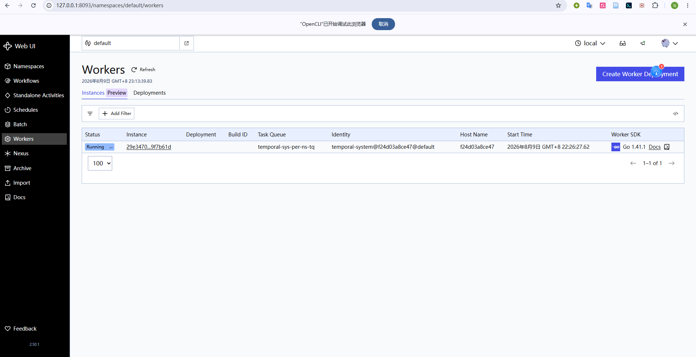

---
sources:
  - title: Marquez
    url: https://github.com/MarquezProject/marquez
  - title: Trrack
    url: https://github.com/Trrack/trrackjs
  - title: Temporal UI
    url: https://github.com/temporalio/ui
---
# 研究界面视觉参考
## Marquez：关系地图

画布占据主体，节点卡片紧凑，类型由图标与形状识别；正交连线、缩略图、深度和完整路径控制支持大图导航。研究地图复用拓扑、路径控制和全局定位，不把字段明细铺在节点上。
## Trrack：节点时间线

细线、圆点和单一当前态足以表达顺序与分支，早期节点可作为分叉入口。时间线进入节点详情，展示提交、执行、退修、重跑和审核，不承担因果关系或失效传播。
## Temporal：Worker 注册表

Worker 作为独立运维对象按 namespace、deployment、task queue、identity、host 和 SDK 检索。集群容量与运行资源使用表格和筛选器，不混入研究地图。
## 组合
研究地图、节点时间线和 Worker 注册表是同一产品的三个读模型；行动节点以 ID 连接运行实例，时间顺序不替代科学依赖，Worker 状态不成为研究结论。
